# 中国大学生计算机设计大赛 - UML图代码

本文档包含第二章概要设计中各模块的UML图代码

---

## 0. 系统架构图【组件图 Component Diagram】
**对应位置**：中国大学生计算机设计大赛.md - 2.1 系统架构

```plantuml
@startuml
!theme plain
skinparam backgroundColor white
skinparam componentBackgroundColor #f8f9fa
skinparam componentBorderColor #6c757d
skinparam packageBackgroundColor #e9ecef

top to bottom direction

component [页面管理模块] as PageManager
component [图片处理模块] as ImageProc
component [拼图游戏模块] as PuzzleGame
component [音乐播放模块] as MusicPlayer
component [教程模块] as Tutorial

PageManager --|> ImageProc : 管理

ImageProc --|> PuzzleGame : 图片数据
PuzzleGame --|> MusicPlayer : 状态同步
PuzzleGame --|> Tutorial : 引导触发
  component [Web Audio API] as AudioAPI
  component [Storage API] as StorageAPI
}

' 页面流转
HomePage --> ControlPanel
ControlPanel --> GameInterface
GameInterface --> CompletePage

' 核心交互
ControlPanel --> ImageProcessor
GameInterface --> PuzzleEngine
GameInterface --> InteractionController
GameInterface --> MusicPlayer

' API调用
ImageProcessor --> CanvasAPI
ImageProcessor --> FileAPI
MusicPlayer --> AudioAPI
LocalStorage --> StorageAPI

' 存储关系
PuzzleEngine --> LocalStorage
MusicPlayer --> LocalStorage

@enduml
```

---

## 1. 图片处理模块流程图【活动图 Activity Diagram】
**对应文档位置**：`中国大学生计算机设计大赛.md` → 第二章 概要设计 → 2.2.2 图片处理模块

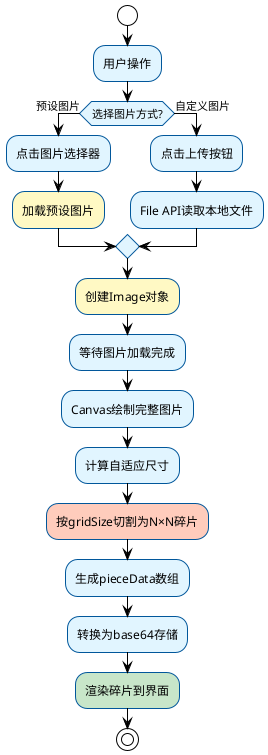

---

## 2. 音乐播放模块类图【类图 Class Diagram】
**对应文档位置**：`中国大学生计算机设计大赛.md` → 第二章 概要设计 → 2.2.5 音乐播放模块（MusicPlayer类）

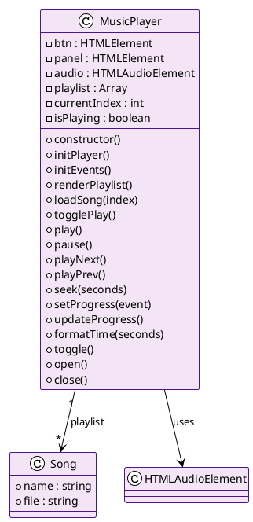

**功能说明**：
- **播放控制**：支持播放/暂停、上一首/下一首、快进/快退
- **播放列表管理**：动态渲染歌曲列表，支持点击切歌
- **进度控制**：实时更新播放进度，支持拖动进度条跳转
- **自动播放**：歌曲结束后自动播放下一首
- **界面交互**：面板展开/收起，播放状态实时反馈

---

## 3. 拼图游戏模块类图【类图 Class Diagram】
**对应文档位置**：`中国大学生计算机设计大赛.md` → 第二章 概要设计 → 2.2.3 拼图游戏模块（PuzzleGame类）

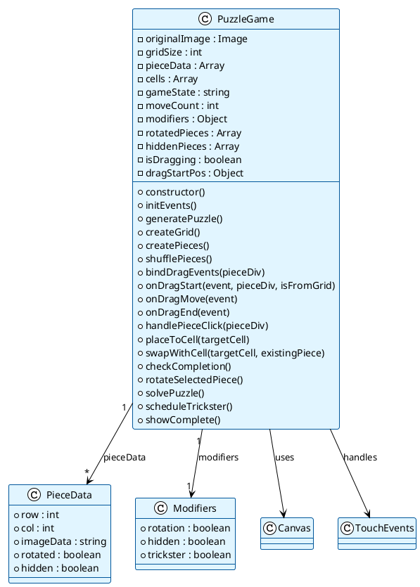

**核心功能**：
- **拼图生成**：根据难度等级切割图片，生成碎片数据
- **交互处理**：支持拖拽和点击双模式，区分操作意图
- **难度词条**：旋转、隐藏、捣蛋鬼三种增强难度选项
- **完成检测**：实时检测所有碎片是否正确放置
- **辅助功能**：打乱、求解、旋转等操作

---

## 4. 模块调用关系流程图【活动图/时序图 Activity/Sequence Diagram】
**对应文档位置**：`中国大学生计算机设计大赛.md` → 第二章 概要设计 → 2.3 模块调用关系

### 方案A：详细活动图【活动图 Activity Diagram】
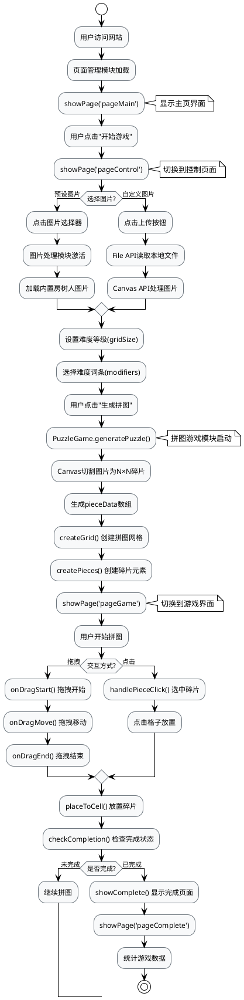

### 方案B：序列图【时序图 Sequence Diagram】（推荐，更简洁）
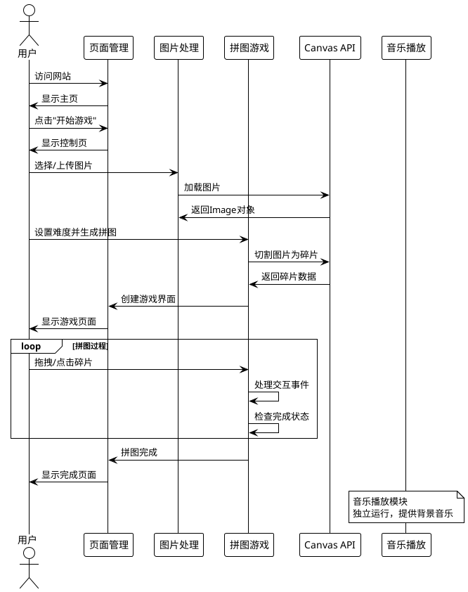

---

## 5. 人机交互界面结构图【组件图 Component Diagram】
**对应文档位置**：`中国大学生计算机设计大赛.md` → 第二章 概要设计 → 2.4 人机交互界面

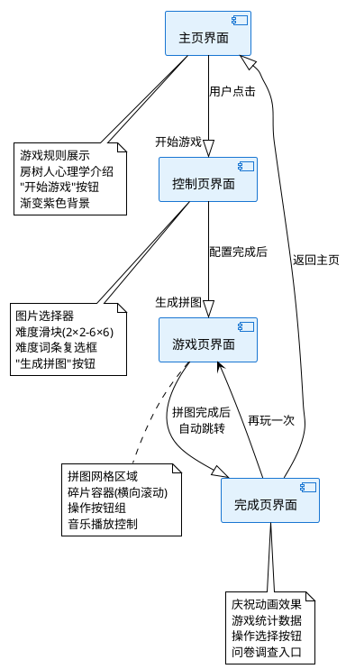

---

## 3.1.1 主页界面示意图【界面设计图 Interface Design Diagram】
**对应位置**：中国大学生计算机设计大赛.md - 3.1.1 主页界面
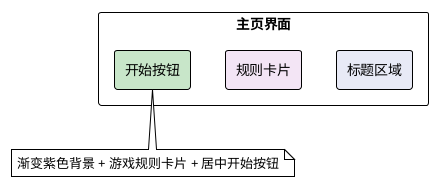

## 3.1.2 控制配置界面示意图【界面设计图 Interface Design Diagram】
**对应位置**：中国大学生计算机设计大赛.md - 3.1.2 控制配置界面
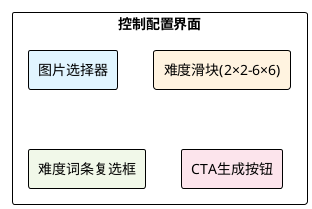

## 3.1.3 游戏主界面示意图【界面设计图 Interface Design Diagram】
**对应位置**：中国大学生计算机设计大赛.md - 3.1.3 游戏主界面
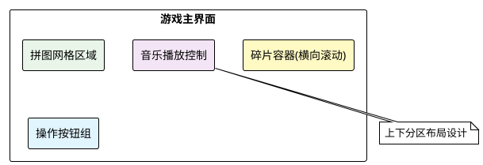

## 3.1.4 完成结算界面示意图【界面设计图 Interface Design Diagram】
**对应位置**：中国大学生计算机设计大赛.md - 3.1.4 完成结算界面
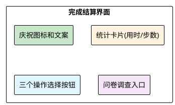

---

## 3.2.1 数据存储方案示意图【部署图 Deployment Diagram】
**对应位置**：中国大学生计算机设计大赛.md - 3.2.1 数据存储方案
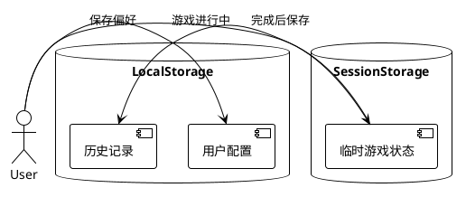

## 3.2.2 数据结构设计示意图【类图 Class Diagram】
**对应位置**：中国大学生计算机设计大赛.md - 3.2.2 数据结构设计
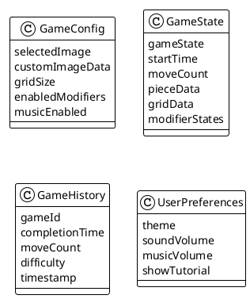

---

## 3.3.1 系统核心类图【类图 Class Diagram】
**对应位置**：中国大学生计算机设计大赛.md - 3.3.1 类图总览

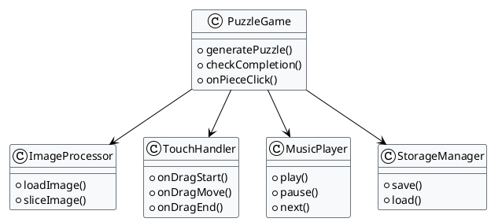

---

## 3.4.1 图像切割算法流程图【活动图 Activity Diagram】
**对应位置**：中国大学生计算机设计大赛.md - 3.4.1 图像切割算法

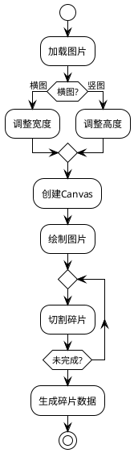

---

## 3.5.1 游戏主状态机【状态图 State Diagram】
**对应位置**：中国大学生计算机设计大赛.md - 3.5.1 游戏状态机

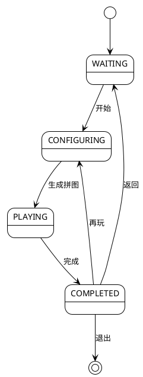

---

## 3.6.1 拖拽操作时序图【时序图 Sequence Diagram】
**对应位置**：中国大学生计算机设计大赛.md - 3.6.1 拖拽操作流程

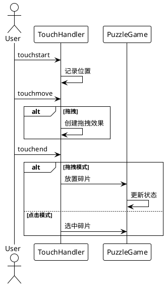

---

## 3.7.1 系统数据流图【数据流图 Data Flow Diagram】
**对应位置**：中国大学生计算机设计大赛.md - 3.7.1 系统数据流图

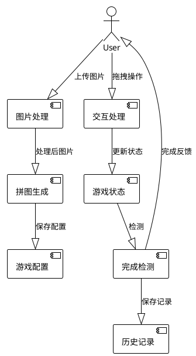

---

## 3.8.1 系统组件依赖关系图【组件图 Component Diagram】
**对应位置**：中国大学生计算机设计大赛.md - 3.8.1 组件依赖图

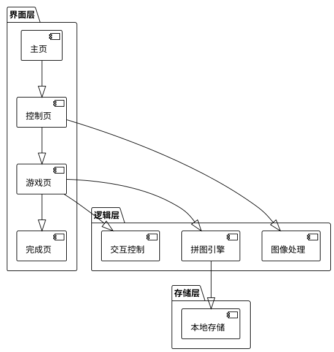

---

## 3.3.2 主要类设计【类图 Class Diagram】
**对应位置**：中国大学生计算机设计大赛.md - 3.3.2 主要类设计

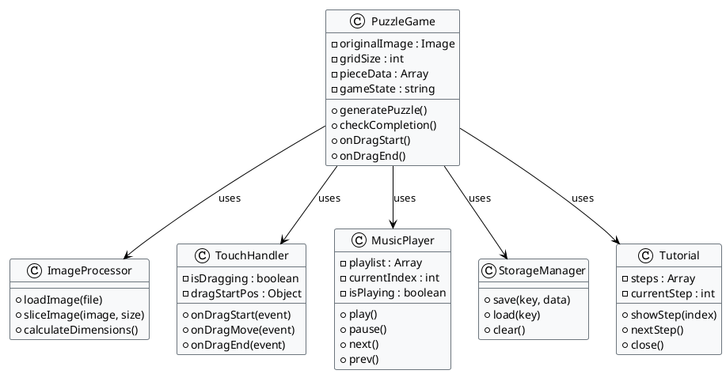

---

## 3.4.2 碎片匹配算法【活动图 Activity Diagram】
**对应位置**：中国大学生计算机设计大赛.md - 3.4.2 碎片匹配算法

```plantuml
@startuml
!theme plain
skinparam backgroundColor white

start
:获取碎片位置信息;
:读取原始行列坐标;
if (坐标匹配?) then (是)
  if (旋转状态?) then (未旋转)
    :标记为正确位置;
    #c8e6c9:添加correct样式;
  else (已旋转)
    :标记为错误位置;
    #ffcdd2:移除correct样式;
  endif
else (否)
  :标记为错误位置;
  #ffcdd2:移除correct样式;
endif
:更新完成计数;
stop
@enduml
```

---

## 3.4.3 难度词条调度算法【活动图 Activity Diagram】
**对应位置**：中国大学生计算机设计大赛.md - 3.4.3 难度词条调度算法

```plantuml
@startuml
!theme plain
skinparam backgroundColor white

start
:初始化难度词条;
if (旋转词条?) then (开启)
  :随机选择碎片;
  :设置180度旋转;
endif
if (隐藏词条?) then (开启)
  :随机隐藏部分碎片;
  :设置display:none;
endif
if (捣蛋鬼词条?) then (开启)
  :启动定时器(15-30秒);
  :检测正确放置的碎片;
  :随机移动一个碎片;
endif
stop
@enduml
```

---

## 3.5.2 碎片交互状态机【状态图 State Diagram】
**对应位置**：中国大学生计算机设计大赛.md - 3.5.2 碎片交互状态机

```plantuml
@startuml
!theme plain
skinparam backgroundColor white

[*] --> 待选中
待选中 --> 选中 : 点击碎片
选中 --> 拖拽 : 触摸移动
选中 --> 待选中 : 点击其他区域
拖拽 --> 放置 : 触摸结束
放置 --> 完成检测 : 碎片到位
完成检测 --> 待选中 : 检测完成
完成检测 --> [*] : 游戏完成

@enduml
```

---

## 3.6.2 碎片放置流程【时序图 Sequence Diagram】
**对应位置**：中国大学生计算机设计大赛.md - 3.6.2 碎片放置流程

```plantuml
@startuml
!theme plain
skinparam backgroundColor white

actor User as U
participant TouchHandler as TH
participant PuzzleGame as PG
participant GridCell as GC

U -> TH : touchstart
TH -> TH : 记录起始位置
U -> TH : touchmove
TH -> TH : 计算移动距离
alt 超过阈值
  TH -> TH : 开始拖拽模式
end
U -> TH : touchend
TH -> PG : 获取目标格子
PG -> GC : 检查格子状态
alt 格子为空
  PG -> GC : 直接放置碎片
else 格子有碎片
  PG -> PG : 交换碎片位置
end
PG -> PG : 更新游戏状态

@enduml
```

---

## 3.6.3 游戏完成检测流程【活动图 Activity Diagram】
**对应位置**：中国大学生计算机设计大赛.md - 3.6.3 游戏完成检测流程

```plantuml
@startuml
!theme plain
skinparam backgroundColor white

start
:触发完成检测;
:遍历所有格子;
repeat
  :获取格子中的碎片;
  if (碎片存在?) then (是)
    :检查坐标匹配;
    :检查旋转状态;
    if (位置正确?) then (是)
      :正确计数+1;
    endif
  endif
repeat while (还有格子?)
:检查隐藏碎片;
if (全部正确?) then (是)
  :停止计时器;
  :显示完成界面;
  :保存游戏记录;
  stop
else (否)
  :继续游戏;
  stop
endif
@enduml
```

---

## 3.7.2 用户操作数据流【数据流图 Data Flow Diagram】
**对应位置**：中国大学生计算机设计大赛.md - 3.7.2 用户操作数据流

```plantuml
@startuml
!theme plain
skinparam backgroundColor white

top to bottom direction

actor User

User --|> [事件捕获] : 用户操作
[事件捕获] --|> [事件分析] : 原始事件
[事件分析] --|> [动作识别] : 事件类型
[动作识别] --|> [状态管理] : 操作指令
[状态管理] --|> [数据更新] : 状态变更
[数据更新] --|> [视图渲染] : 更新数据
[视图渲染] --|> User : 界面反馈

[状态管理] --|> [本地存储] : 持久化

@enduml
```

---

## 3.8.2 模块协作图【组件图 Component Diagram】
**对应位置**：中国大学生计算机设计大赛.md - 3.8.2 模块协作图

```plantuml
@startuml
!theme plain
skinparam backgroundColor white

package "界面层" {
  component [页面管理器] as PageManager
  component [组件渲染器] as ComponentRenderer
}

package "逻辑层" {
  component [游戏引擎] as GameEngine
  component [算法处理器] as AlgorithmProcessor
  component [事件管理器] as EventManager
}

package "存储层" {
  component [缓存管理] as CacheManager
  component [持久化存储] as PersistentStorage
}

' 界面层协作
PageManager --> ComponentRenderer : 渲染请求

' 跨层协作
PageManager --> EventManager : 事件注册
ComponentRenderer --> GameEngine : 状态获取
EventManager --> GameEngine : 事件派发
GameEngine --> AlgorithmProcessor : 算法调用
GameEngine --> CacheManager : 临时存储
CacheManager --> PersistentStorage : 数据持久化

note top of PageManager : 三层架构协作模式\n界面层负责用户交互\n逻辑层处理业务逻辑\n存储层管理数据持久化

@enduml
```

