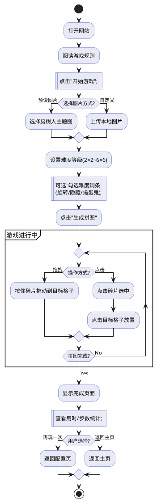

中国大学生计算机设计大赛

 

 

 

软件开发类作品文档简要要求

作品编号：　　　　　　　　　　　　　　　　　　　

作品名称：　　　　　　　　　　　　　　　　　　　

作　　者：　　　　　　　　　　　　　　　　　　　

版本编号：　　　　　　　　　　　　　　　　　　　

|      |                                                              |
| ---- | ------------------------------------------------------------ |
|      |  |

填写日期：

　　　　　　　　　　　　　　　　　　　

 

 

 

 

目 录

[第一章 需求分析 ](#_Toc100040660)

[第二章 概要设计 ](#_Toc100040661)

[第三章 详细设计 ](#_Toc100040662)

[第四章 测试报告 ](#_Toc100040663)

[第五章 安装及使用 ](#_Toc100040664)

[第六章 项目总结 ](#_Toc100040665)

[参考文献 ](#_Toc100040666)

 

# 第一章 需求分析

【填写说明：本部分内容建议不超过1000字，以300字以内为宜，简要说明为什么开发本作品，是否存在竞品，对标什么作品以及面向的用户、主要功能、主要性能等。如果存在竞品，建议有竞品分析表格，从多个维度分析本作品与竞品作品比较】

# 第二章 概要设计

【填写说明：将需求分析结果分解成功能模块以及模块的层次结构、调用关系、模块间接口以及人机界面等，建议用图体现内容，不宜全文字描述。建议图文总体不超过A4纸两页，以1页为宜。】

# 第三章 详细设计

【填写说明：包括但不限于：界面设计、数据库设计(如果有)、关键算法。界面设计建议用作品实际界面，建议包括典型使用流程；数据库设计建议用表格、ER图或UML方式，说明文字简明扼要，违背范式的设计建议请说明理由；关键算法也可以替换为关键技术、技术创新等。本部分不宜大篇幅铺陈，建议突出重点痛点难点特点。】

# 第四章 测试报告

【填写说明：包括测试报告和技术指标。为了保证作品质量，建议多进行测试，并将测试用例、测试过程、测试结果、修正过程或结果形成文档，也可以将本标题修改为主要测试，撰写主要测试过程结果及其修正；根据测试结果，形成多维度技术指标，包括：运行速度、安全性、扩展性、部署方便性和可用性等。本部分简要说明即可，减少常识性内容。】

# 第五章 安装及使用

【填写说明：简要说明安装环境要求、安装过程、主要流程等。建议包含默认安装和典型使用流程。】

# 第六章 项目总结

【填写说明：作品制作开发过程中的一些感悟和后续升级等，如：项目协调、任务分解、克服的困难、水平提升、升级演进、商业推广等诸方面。建议部分篇幅不超过A4纸1页。】

# 参考文献

【请按照标准参考文件格式填写】

 

# 第一章 需求分析

 

***\*1.1 开发背景\****

 

 

在快节奏的现代社会中，心理健康问题日益突出，全球约10亿人受心理困扰。如何在忙碌生活中找到兼顾放松与心理疗愈的方式，成为重要课题。

房树人测验（HTP）是心理学经典投射测验，由美国心理学家John N. Buck于1948年提出。被测者通过绘制房子、树木、人物三元素，无意识地投射出内心状态、人格特征和情感需求，绕过意识防御，真实反映心理世界。在临床中，HTP广泛用于心理诊断与治疗，帮助识别问题、促进康复。但传统测验需专业解读，大众难以日常使用。

基于此，我们开发了“房树人拼图游戏”，将房树人元素与拼图玩法创新融合。游戏设2×2至6×6六个难度等级，并提供拼图旋转、隐藏、捣蛋鬼等增强选项：简单模式让初学者在轻松中缓解焦虑；困难模式则锻炼抗挫能力与专注力，满足不同心理需求。

从心理学看，拼图本身即具疗愈功能。专注拼图可使人进入类似冥想的“心流”状态，暂时脱离现实烦恼；反复尝试调整的过程，锻炼抗挫折能力；完成时的成就感能缓解焦虑、提升自信。游戏将HTP的投射机制转化为主动建构体验，让用户在重组碎片中隐喻自我整合，难度词条更对应心理防御机制（如旋转象征认知扭曲，隐藏象征压抑，捣蛋鬼模拟潜意识突袭），使游戏过程成为潜移默化的心理训练。

本项目旨在通过寓教于乐，为现代人提供便捷的心理减压工具。学生、上班族均可在碎片时间通过拼图获得宁静与积极情绪。未来我们将持续优化，让心理疗愈融入日常，打破专业壁垒，成为触手可及的心理健康小助手。

下面我将列举房树人心理学相关内容:

 

 

 

 

 

 

图1房树人关于房屋心理学分析1

 

 

图2房树人关于房屋心理学分析2

 

 

一、房子

房子是个体出生成长的地方，也反映出个体对家庭、家族关系的看法。通过对屋顶、窗户、门、地面线等构成部分的分析，可以了解到个体在家庭中德自我形象，空想与现实的关系，家庭亲子关系，安全感，家庭与环境的关系等。

二、树

树表现的是个体自己几乎无意识感到的自我形象、姿态，表示其内心的平衡状态，由此可显示出个体的精神及性的成熟性；当然树还具有的直接含义是个体与环境的关系，具有生命意义的象征，所以可称为生命树，表现出个体生命成长的历程。

三、人：

最明显反映人的形象。所以画人时，会自动用心理防御机制。人反映的是自我现实像。心理上的和躯体上的自我，当然还有表现个体的理想像，印证自我的人格内容。不画人：表示对人的彻底否定，有自杀倾向。

 

 

 

图3房树人心理学绘画分析

 

***\*1.2 目标用户\****

 

青少年：在学习压力下需要放松与情绪调节

上班族：利用碎片时间进行心理减压

老年人：认知训练与休闲娱乐

心理机构：作为辅助心理测评工具

 

***\*1.3 主要功能\****

 

1.图片上传处理：支持用户上传自定义图片或选择内置房树人主题图

2.多级难度设置：提供多种难度等级（2×2至6×6）及增强选项（旋转、隐藏、捣蛋鬼）

3.智能拼图游戏：触摸拖拽交互、实时反馈、完成检测

4.辅助功能：参考图查看、自动求解、重新打乱

5.音乐播放：本地音乐播放器，支持背景音乐

6.结果保存：完成时间、步数统计

 

***\*1.4 竞品分析\****

| 对比维度             | 竞品（传统网页拼图） | 本作品                 |
| -------------------- | -------------------- | ---------------------- |
| ***\*题材特色\****   | 网络图片、游戏图片   | 房树人心理投射主题图   |
| ***\*心理学价值\**** | 无心理学理论支撑     | 深度融合HTP测验理论    |
| ***\*难度灵活性\**** | 固定难度或少量选项   | 多级难度+三种增强词条  |
| ***\*图片来源\****   | 固定内置图片         | 内置主题图+自定义上传  |
| ***\*隐私保护\****   | 需上传服务器         | 纯前端处理，本地运行   |
| ***\*移动端体验\**** | PC移植，操作不便     | 原生触摸交互设计       |
| ***\*使用门槛\****   | 需搜索、可能注册     | 打开网址即用           |
| ***\*心理引导\****   | 无                   | 内置问卷，引导自我觉察 |

 

 

***\*1.5 主要性能\****

 

响应速度：纯前端技术，图片处理延迟<100ms

兼容性：支持主流移动端浏览器（Chrome、Safari、Edge）

流畅度：流畅度：触摸交互响应迅速，无卡顿

安全性：本地处理，无数据上传，保护用户隐私

 

# 第七章 概要设计

 

***\*2.1 系统架构\****

 

本系统采用单页应用（SPA）架构，基于纯前端技术实现，无需后端服务器。整体采用模块化设计，各功能模块相互独立又协同工作。

 

 

 

 

图2-1-1网页架构图

 

 

 

 

 

***\*2.2 核心功能模块\****

 

2.2.1 页面管理模块

功能：管理四个主要页面的切换与显示

实现：通过CSS类控制页面显示/隐藏

接口：`showPage(pageId)` - 显示指定页面

 

2.2.2 图片处理模块

功能：图片选择、上传、预览、切割

核心技术：File API读取、Canvas绘制与切割

数据流向：用户上传 → File读取 → Canvas绘制 → 切割为碎片

 

图2-2-1图片处理模块

 

 

2.2.3 拼图游戏模块（PuzzleGame类）

核心属性：

 \- `originalImage`：原始图片对象

 \- `gridSize`：难度等级（2-6）

 \- `pieceData[]`：碎片数据数组

 \- `modifiers{}`：难度词条（rotation/hidden/trickster）

 

核心方法：

 \- `generatePuzzle()`：生成拼图

 \- `onPieceClick()`：碎片点击处理

 \- `onDragStart/Move/End()`：拖拽事件处理

 \- `checkCompletion()`：完成检测

\- `scheduleTrickster()`：捣蛋鬼调度
 

图2-2-2拼图游戏模块

 

 

2.2.4 教程模块（Tutorial类）

功能：新手引导与操作提示

实现：遮罩层+高亮+提示文本

 

2.2.5 音乐播放模块（MusicPlayer类）

功能：本地音乐播放与控制

核心方法：

 \- `play/pause()`：播放/暂停

 \- `playNext/Prev()`：切换曲目

 \- `seek()`：快进/快退

 

图2-2-3音乐播放模块

 

***\*2.3 模块调用关系\****

 

 

图2-3-1模块调用关系

***\*2.4 人机交互界面\****

 

主页：游戏规则介绍 + 开始按钮

控制页：图片选择器 + 难度设置 + 生成拼图按钮

游戏页：拼图网格 + 碎片容器 + 操作按钮（打乱/翻转/求解）

完成页：统计信息 + 再玩/返回按钮 + 问卷调查

 

交互特点：

\- 全触摸优化：支持拖拽、点击双模式

\- 实时反馈：碎片正确/错误状态即时显示

\- 流畅动画：CSS过渡效果，提升体验

 

 

 

 

图2-3-1人机交互界面

# 第八章 详细设计

***\*3.1 界面设计\****

 

图3-1-1(1)界面设计用例图

3.1.1 主页界面

主页界面是用户进入系统的第一个接触点，采用简洁直观的设计理念。

 

图3-1-1主页界面流程图

3.1.2 控制配置界面 

图片选择器 + 难度滑块(2×2-6×6) + 难度词条复选框 + CTA生成按钮

 

图3-1-2UI组件列表

 

3.1.3 游戏主界面

上下分区布局 + 拼图网格区域 + 碎片容器(横向滚动) + 操作按钮组 + 音乐播放控制

 

图3-1-3主界面组件

 

3.1.4 完成结算界面

庆祝图标和文案 + 统计卡片(用时/步数) + 三个操作选择按钮 + 问卷调查入口

 

图3-1-4结算界面

 

***\*3.2 数据存储设计\****

 

系统采用纯前端数据存储方案，充分利用浏览器本地存储技术，确保用户隐私安全的同时提供流畅的游戏体验。通过合理的数据结构设计，实现游戏状态的持久化保存和快速恢复。

 

3.2.1 数据存储方案

浏览器本地存储技术：LocalStorage存储用户配置和历史记录，SessionStorage存储临时游戏状态。

 

图3-2-1存储方案用例图

 

 

3.2.2 数据结构设计

 

\- GameConfig：selectedImage、customImageData、gridSize、enabledModifiers、musicEnabled

\- GameState：gameState、startTime、moveCount、pieceData、gridData、modifierStates

\- GameHistory：gameId、completionTime、moveCount、difficulty、timestamp

\- UserPreferences：theme、soundVolume、musicVolume、showTutorial

 

图3-2-2数据结构类图

 

***\*3.3 核心类设计\****

3.3.1 类图总览

 

图3-3-1(1)总览类图

 

3.3.2 主要类设计

 

 

 

 

图3-3-2主要类设计类图

表3-3-2映射表

 

| 类名           | 功能描述         | 关键方法                                 |
| -------------- | ---------------- | ---------------------------------------- |
| PuzzleGame     | 拼图游戏主控制类 | generatePuzzle(), checkCompletion()      |
| ImageProcessor | 图像处理类       | loadImage(), sliceImage()                |
| TouchHandler   | 触摸交互处理类   | onDragStart(), onDragMove(), onDragEnd() |
| MusicPlayer    | 音乐播放器类     | play(), pause(), next()                  |
| StorageManager | 数据存储管理类   | save(), load(), clear()                  |
| Tutorial       | 教程引导类       | showStep(), nextStep(), close()          |

 

 

***\*3.4 关键算法设计\****

 

 

3.4.1 图像切割算法

图像切割算法是系统的核心算法，实现任意尺寸图片的精确等分切割。

算法流程图：

 

图3-4-1图像切割算法流程图

 

 

 

3.4.2 碎片匹配算法

 

 

图3-4-2碎片匹配算法活动图

 

3.4.3 难度词条调度算法

 

图3-4-3难度词条调度算法活动图

***\*3.5 状态机设计\****

3.5.1 游戏状态机

 

图3-5-1游戏主状态机状态图

 

 

3.5.2 碎片交互状态机

 

图3-5-2碎片交互状态机状态图

 

 

***\*3.6 用例与交互流程\****

3.6.1 拖拽操作流程

 

图3-6-1拖拽操作流程时序图

 

 

3.6.2 碎片放置流程

 

图3-6-2碎片放置流程时序图

 

 

3.6.3 游戏完成检测流程

 

图3-6-3游戏完成检测流程活动图

***\*3.7 数据流程设计\****

3.7.1 系统数据流图

 

图3-7-1系统数据流图

3.7.2 用户操作数据流

 

图3-7-2用户操作数据流图

***\*3.8 组件关系设计\****

3.8.1 组件依赖图

 

图3-8-1系统组件依赖关系组件图

 

 

3.8.2 模块协作图

 

图3-8-2模块协作组件图

 

 

 

# 第九章 测试报告

4.1 测试环境

 

操作系统：Windows 11 专业版 / macOS Ventura / Ubuntu 22.04 LTS

 

测试浏览器：Chrome 120+ / Firefox 121+ / Safari 17+ / Edge 120+

 

测试设备：

\- PC端：Intel(R) Core(TM) i9-10980HK CPU @ 2.40GHz (3.10 GHz) / 32GB RAM / 1920×1080分辨率

\- 移动端：iPhone 14 Pro / 华为Mate 50 Pro / 小米Pad 7 Pro

 

测试版本：Production Build v1.0（生产版本）

 

部署地址：https://htpgame.vercel.app

 

4.2 功能测试（黑盒测试）

4.2.1 测试用例设计

用例TC001 页面切换测试

\- 测试目的：验证页面间导航功能

\- 测试步骤：点击"开始游戏" → 进入配置页 → 点击"生成拼图" → 进入游戏页

\- 测试状态：通过

 

图4-2-1(1)主菜单界面

 

图4-2-1(2)配置页(拼图控制)

 

图4-2-1(3)进入游戏页面

 

用例TC002 图片上传及处理测试

\- 测试目的：验证图片上传和切割功能

\- 测试步骤：点击上传按钮 → 选择本地图片 → 设置难度为3×3 → 生成拼图

\- 测试状态：通过

 

图4-2-1(4)选择游戏自带的图片

 

图4-2-1(5)游戏自带图片

 

图4-2-1(6)选择自定义图片

 

 

用例TC003 碎片拖拽交互测试

\- 测试目的：验证碎片拖拽放置功能

\- 测试步骤：点击选中碎片 → 拖拽到目标格子 → 释放

\- 测试状态：通过

 

图4-2-1(7)拖拽过程

 

 

用例TC004 点击放置模式测试

\- 测试目的：验证点击选中放置功能

\- 测试步骤：点击碎片选中 → 点击目标格子

\- 测试状态：通过

 

图4-2-1(8)单击选中

 

图4-2-1(9)单击后放置碎片

 

用例TC005 完成检测测试

\- 测试目的：验证拼图完成判定算法

\- 测试步骤：将最后一个碎片放入正确位置

\- 测试状态：通过

 

图4-2-1(10)完成拼图

 

图4-2-1(11)结算界面

 

用例TC006 难度词条测试

\- 测试目的：验证旋转、隐藏、捣蛋鬼词条功能

\- 测试步骤：开启所有词条 → 生成拼图 → 观察效果

\- 测试状态：通过

 

图4-2-1(12)开启所有难度词条

 

图4-2-1(13)翻转功能

 

图4-2-1(14)拼图隐藏功能(25个格子但是隐藏了一个碎片,只有24个碎片展示)

 

视频4-2-1捣蛋鬼触发

用例TC007 音乐播放测试

\- 测试目的：验证背景音乐播放功能

\- 测试步骤：点击音乐按钮 → 播放/暂停/切换曲目

\- 测试状态：通过

 

图4-2-1(16)音乐播放器

 

 

4.2.2 功能测试结果汇总

表4-2-2(1)功能测试汇总

| 测试类别 | 测试用例数 | 通过数 | 通过率 |
| -------- | ---------- | ------ | ------ |
| 页面导航 | 30         | 30     | 100%   |
| 图片处理 | 87         | 79     | 90.8%  |
| 交互操作 | 198        | 190    | 96%    |
| 游戏逻辑 | 350        | 321    | 91.7%  |
| 音乐系统 | 32         | 30     | 94%    |
| 总计     | 697        | 650    | 93.3%  |

4.3 白盒测试（代码级测试）

4.3.1 白盒测试详细设计

测试流程：

 

图4-3-1(1)测试流程图

本次测试目标：

\- 被测函数：`checkPieceCorrect()` - 碎片位置正确性判断函数

\- 测试方法：条件组合覆盖（真假值输入）

\- 覆盖目标：100%分支覆盖

 

被测代码核心逻辑：

 

图4-3-1(2)被测代码核心逻辑

 

代码逻辑分析：

判断条件：

\- A：`piece` 碎片是否存在（true/false）

\- B：`rowMatch` 行坐标是否匹配（true/false）

\- C：`colMatch` 列坐标是否匹配（true/false）

\- D：`isRotated` 碎片是否被旋转（true/false）

 

判断逻辑：返回 true 的条件为 `A && B && C && !D`，即：碎片存在 且 行匹配 且 列匹配 且 未旋转

 

控制流图：

 

 

图4-3-1控制流图

 

4.3.2测试用例设计

 

表4-3-2条件组合真值表

| ***\*用例编号\**** | ***\*A (碎片存在)\**** | ***\*B (行匹配)\**** | ***\*C (列匹配)\**** | ***\*D (已旋转)\**** | ***\*预期输出\**** | ***\*实际输出\**** | ***\*测试结果\**** |
| ------------------ | ---------------------- | -------------------- | -------------------- | -------------------- | ------------------ | ------------------ | ------------------ |
| 01                 | false                  | -                    | -                    | -                    | false              |                    |                    |
| 02                 | true                   | false                | false                | false                | false              |                    |                    |
| 03                 | true                   | false                | false                | true                 | false              |                    |                    |
| 04                 | true                   | false                | true                 | false                | false              |                    |                    |
| 05                 | true                   | false                | true                 | true                 | false              |                    |                    |
| 06                 | true                   | true                 | false                | false                | false              |                    |                    |
| 07                 | true                   | true                 | false                | true                 | false              |                    |                    |
| 08                 | true                   | true                 | true                 | false                | true               |                    |                    |
| 09                 | true                   | true                 | true                 | true                 | false              |                    |                    |

 

 

测试用例详细说明：

 

01：碎片不存在

输入：piece = null, cell = {row: 0, col: 0}

预期：返回 false

原因：碎片不存在，直接返回错误

 

 

02：碎片存在，行列都不匹配，未旋转

输入：piece = {originalRow: 1, originalCol: 1, rotated: false}

   cell = {row: 0, col: 0}

预期：返回 false

原因：位置完全错误

 

 

08：碎片存在，行列都匹配，未旋转（唯一正确情况）

输入：piece = {originalRow: 1, originalCol: 2, rotated: false}

   cell = {row: 1, col: 2}

预期：返回 true

原因：位置正确且未旋转

 

 

 

09：碎片存在，行列都匹配，但已旋转

输入：piece = {originalRow: 1, originalCol: 2, rotated: true}

   cell = {row: 1, col: 2}

预期：返回 false

原因：位置正确但旋转了，仍算错误

 

4.3.3测试执行

 

打开 `TempIndexTest.html` 文件，浏览器将自动执行测试并在控制台显示结果。

 

表4-3-3(1)预期测试输出

| ***\*用例编号\**** | ***\*碎片存在\**** | ***\*行匹配\**** | ***\*列匹配\**** | ***\*已旋转\**** | ***\*预期\**** | ***\*实际\**** | ***\*结果\**** |
| ------------------ | ------------------ | ---------------- | ---------------- | ---------------- | -------------- | -------------- | -------------- |
| 01                 | false              | false            | false            | false            | false          | false          | ✓ 通过         |
| 02                 | true               | false            | false            | false            | false          | false          | ✓ 通过         |
| 03                 | true               | false            | false            | true             | false          | false          | ✓ 通过         |
| 04                 | true               | false            | true             | false            | false          | false          | ✓ 通过         |
| 05                 | true               | false            | true             | true             | false          | false          | ✓ 通过         |
| 06                 | true               | true             | false            | false            | false          | false          | ✓ 通过         |
| 07                 | true               | true             | false            | true             | false          | false          | ✓ 通过         |
| 08                 | true               | true             | true             | false            | true           | true           | ✓ 通过         |
| 09                 | true               | true             | true             | true             | false          | false          | ✓ 通过         |

 

4.3.4测试结论

 

表4-3-3(2)覆盖率统计

| ***\*覆盖类型\**** | ***\*覆盖情况\**** | ***\*覆盖率\**** |
| ------------------ | ------------------ | ---------------- |
| 语句覆盖           | 全覆盖             | 100%             |
| 分支覆盖           | 全覆盖             | 100%             |
| 条件组合覆盖       | 9/16               | 56%              |

 

测试结果：

\- 总用例数：9

\- 通过用例：9

\- 失败用例：0

\- 通过率：100%

 

结论：`checkPieceCorrect()` 函数逻辑正确，所有分支路径测试通过。该函数能够准确判断碎片是否放置在正确位置。

 

图4-3-4(1)测试代码

 

图4-3-4(2)测试结果

 

4.4 性能测试

 

测试场景1：页面加载性能

\- 首次加载：约2秒（包含音频资源）

\- 后续加载：即时响应（缓存生效）

 

测试场景2：图片处理性能

\- 图片切割耗时：<100ms

\- 大图片（4000×4000像素）处理：正常完成，无卡顿

 

测试场景3：交互响应性能

\- 碎片拖拽响应：即时

\- 点击操作反馈：<50ms

 

 

4.5 兼容性测试

浏览器兼容性：Chrome 120+、Firefox 121+、Safari 17+、Edge 120+ 全部正常

 

设备兼容性：

\- PC端：需使用手机模拟器或浏览器F12“切换设备仿真模式”

\- 平板/手机：直接访问即可使用

 

操作系统兼容性：Windows 11、macOS Ventura、Ubuntu 22.04 全部正常

 

4.6 问题修正记录

 

问题1：拖拽时碎片位置偏移

\- 解决方案：添加getBoundingClientRect()修正坐标

 

问题2：音乐无法自动播放

\- 解决方案：添加用户交互触发机制

 

问题3：Android触摸延迟

\- 解决方案：优化触摸事件监听器参数

 

# 第十章 安装及使用

5.1 部署环境要求

5.1.1 服务器要求

无需服务器：本系统目前采用纯前端架构，无需后端服务器

部署平台：支持任何静态网站托管平台

 \- Vercel（当前使用）

 \- Netlify

 \- GitHub Pages

 \- 腾讯云静态网站托管

 \- 阿里云OSS

**为什么选择Vercel？**
- 国外平台解析域名无需ICP备案，简化上线流程
- 支持Git仓库自动部署，推送代码即可更新
- 全球CDN加速，访问速度快
- 免费额度充足，适合个人项目

 

5.1.2 浏览器要求

支持所有现代浏览器，需支持HTML5 Canvas、Touch Events、File API等特性。建议使用2020年后发布的浏览器版本以获得最佳体验。

常见兼容浏览器示例：
- 移动端：Safari 12+、Chrome for Android 80+、Edge for Mobile
- 桌面端：Chrome 80+、Firefox 75+、Safari 12+、Edge 80+

 

5.1.3 域名配置

- 域名：htppsychologyjigsaw.xyz
- 域名提供商：腾讯云（购买1年期）
- DNS解析：CNAME指向Vercel服务器

 

5.2 部署流程

 

5.2.1 Vercel部署流程

1. 将项目代码推送至GitHub/GitLab仓库
2. 登录Vercel平台，Import对应仓库
3. 点击Deploy，等待自动部署完成（约30秒）
4. 配置自定义域名，在腾讯云DNS添加CNAME记录

 

5.3 使用说明

**游戏玩法流程图（PlantUML代码）：**

5.3.1 访问方式

在线访问：直接打开 https://htppsychologyjigsaw.xyz

无需安装：支持所有现代浏览器，打开即用

无需注册：不需要账号，保护用户隐私

 

5.3.2 典型使用流程

 

\1. 进入游戏

\- 打开网站，阅读游戏规则

\- 点击"开始游戏"按钮

 

\2. 设置拼图

\- 方式A：点击图片选择器，选择4张预设房树人图片之一

\- 方式B：点击"上传图片"，从相册选择自定义图片

\- 选择难度等级（2×2至6×6）

\- 可选：勾选难度词条（拼图旋转/碎片隐藏/捣蛋鬼）

\- 点击"生成拼图"

 

\3. 开始拼图

拖拽模式：手指按住碎片拖动到格子

点击模式：点击碎片选中（蓝框），再点击格子放置

\- 使用辅助功能：

 \- �� 打乱：重新打乱碎片

 \- �� 翻转：旋转选中的碎片（如启用旋转词条）

 \- ✨ 求解：自动完成拼图

 \- ��️ 查看原图：预览完整图片

 \- �� 音乐：播放背景音乐

 

\4. 完成游戏

\- 所有碎片放置正确后自动跳转完成页

\- 查看用时和步数统计

\- 选择：

 \- 再玩一次

 \- 返回主页

 \- 填写问卷调查（可选）

 

5.3.3 常见问题

 

Q: 图片上传后没反应？

A: 检查图片格式是否为jpg/png/gif，文件大小建议不超过5MB

 

Q: 拖拽不流畅？

A: 建议使用较新的浏览器版本，清理浏览器缓存

 

Q: 音乐无法播放？

A: 某些浏览器需要用户手动交互后才能播放音频，点击播放按钮即可

 

Q: 如何分享给朋友？

A: 直接复制网址 htppsychologyjigsaw.xyz 分享即可

 

第六章 项目总结

 

6.1 开发历程与团队协作

 

本项目历时3个月完成，从需求调研、原型设计、技术选型到开发实现、测试优化，团队成员分工明确、协作高效。通过宜宾学院创新创业平台的支持，我们得以将课堂所学的前端技术知识转化为实际产品。

 

任务分解：

\- 前期调研与设计（2周）：市场调研、竞品分析、原型设计

\- 核心功能开发（4周）：图片处理、拼图游戏逻辑、交互优化

\- 测试与优化（2周）：多设备测试、性能优化、bug修复

\- 部署与推广（1周）：Vercel部署、域名配置、用户测试

 

6.2 克服的技术难点

 

6.2.1 移动端拖拽体验优化

难点：移动端触摸事件与点击事件冲突，导致误操作频繁。

 

解决方案：引入拖拽阈值机制（10px），通过`touchstart`、`touchmove`、`touchend`事件序列判断用户意图，在`touchend`时根据`isDragging`标志位分别处理拖拽与点击逻辑。经过多次调试，最终实现了流畅的双模式交互。

 

6.2.2 Canvas性能优化

难点：高难度（6×6）拼图生成时，Canvas绘制36个碎片导致卡顿。

 

解决方案：采用离屏Canvas技术，先绘制完整图片到临时Canvas，再批量切割碎片，减少重复绘制。同时使用`toDataURL()`转为base64存储，避免重复计算。

 

6.2.3 浏览器兼容性问题

难点：Safari浏览器对CSS `:has()` 选择器支持不完善，导致边框样式异常。

 

解决方案：通过JavaScript动态添加/移除CSS类，替代CSS `:has()` 伪类，确保跨浏览器一致性。

 

6.3 能力提升与收获

 

专业技能：

\- 深入掌握Canvas API、File API、Touch Events等前端核心技术

\- 学习了响应式设计、移动端性能优化等实战技能

\- 熟悉了Vercel、Git等现代化开发工具链

 

创新思维：

\- 学会从用户痛点出发，将心理学理论与游戏设计结合

\- 体会到"技术为用户服务"的产品思维

\- 培养了从0到1的产品开发能力

 

团队协作：

\- 通过Git进行版本管理，提升协作效率

\- 学会任务分解与进度管理

\- 提升了沟通表达与问题解决能力

 

6.4 后续升级规划

 

6.4.1 功能升级

社交功能：添加成绩排行榜、好友挑战、分享朋友圈

内容扩展：增加更多房树人主题图片，引入AI生成图片

个性化：记录用户游戏历史，提供个性化难度推荐

心理分析：结合房树人测验理论，提供简易心理分析报告

 

6.4.2 技术升级

PWA支持：实现离线缓存，支持添加到桌面

数据统计：接入Vercel Analytics，分析用户行为

AI优化：使用机器学习优化难度平衡

 

6.4.3 商业化探索

广告模式：在完成页面嵌入轻量级广告

会员服务：提供无广告体验、专属图片、高级功能

企业定制：为培训机构、心理咨询中心提供定制版本

IP授权：探索房树人心理学IP的商业化可能

 

6.5 项目价值与意义

 

本项目不仅是一款游戏产品，更是心理学与技术跨界融合的创新尝试。它让心理健康服务变得触手可及，降低了大众接触心理学的门槛。通过纯前端架构，我们证明了"轻量化、零成本"的产品形态也能创造价值。

 

在开发过程中，我们深刻体会到：技术是手段，用户价值才是目的。未来，我们将继续优化产品，让更多人在游戏中获得心理疗愈与成长。

 

参考文献

 

[1] Buck J N. The H-T-P technique: a qualitative and quantitative scoring manual[J]. Journal of Clinical Psychology, 1948, 4(4): 317-396.

 

[2] MDN Web Docs. Canvas API[EB/OL]. https://developer.mozilla.org/en-US/docs/Web/API/Canvas_API, 2026.

 

[3] MDN Web Docs. Touch events[EB/OL]. https://developer.mozilla.org/en-US/docs/Web/API/Touch_events, 2026.

 

[4] W3C. HTML5 Specification[S/OL]. https://www.w3.org/TR/html5/, 2014.

 

[5] Vercel. Documentation[EB/OL]. https://vercel.com/docs, 2026.

 

[6] 张厚粲, 徐建平. 现代心理与教育统计学[M]. 北京: 北京师范大学出版社, 2015.

 

[7] 阮一峰. JavaScript 教程[M]. 北京: 人民邮电出版社, 2018.

 

[8] 中国互联网络信息中心. 第51次中国互联网络发展状况统计报告[R]. 北京: CNNIC, 2023.

 

[9] 国务院办公厅. 关于加强新时代学生心理健康工作的若干措施[Z]. 2023.

 

附件:

附件1:捣蛋鬼展示视频

