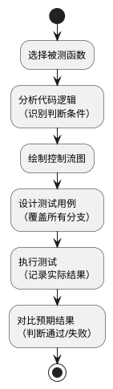
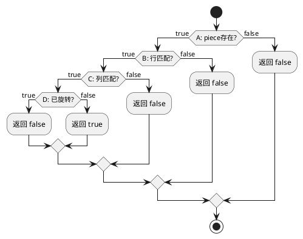

4.3.3 白盒测试详细设计

**测试流程（PlantUML代码）：**



**本次测试目标：**
- 被测函数：`checkPieceCorrect()` - 碎片位置正确性判断函数
- 测试方法：条件组合覆盖（真假值输入）
- 覆盖目标：100%分支覆盖

**被测代码核心逻辑（摘自 index.html）：**

```javascript
// 判断碎片是否放置正确
if (originalRow === cellRow && originalCol === cellCol && !isRotated) {
    return true;  // 正确
} else {
    return false; // 错误
}
```

**代码逻辑分析：**

判断条件：
- **A**：`piece` 碎片是否存在（true/false）
- **B**：`rowMatch` 行坐标是否匹配（true/false）
- **C**：`colMatch` 列坐标是否匹配（true/false）
- **D**：`isRotated` 碎片是否被旋转（true/false）

判断逻辑：返回 true 的条件为 `A && B && C && !D`，即：碎片存在 且 行匹配 且 列匹配 且 未旋转

**控制流图（PlantUML代码）：**



4.3.4 测试用例设计

**条件组合真值表：**

| 用例编号 | A (碎片存在) | B (行匹配) | C (列匹配) | D (已旋转) | 预期输出 | 实际输出 | 测试结果 |
|----------|--------------|------------|------------|------------|----------|----------|----------|
| TC-WB-01 | false        | -          | -          | -          | false    |          |          |
| TC-WB-02 | true         | false      | false      | false      | false    |          |          |
| TC-WB-03 | true         | false      | false      | true       | false    |          |          |
| TC-WB-04 | true         | false      | true       | false      | false    |          |          |
| TC-WB-05 | true         | false      | true       | true       | false    |          |          |
| TC-WB-06 | true         | true       | false      | false      | false    |          |          |
| TC-WB-07 | true         | true       | false      | true       | false    |          |          |
| TC-WB-08 | true         | true       | true       | false      | **true** |          |          |
| TC-WB-09 | true         | true       | true       | true       | false    |          |          |

**测试用例详细说明：**

TC-WB-01：碎片不存在
```javascript
输入：piece = null, cell = {row: 0, col: 0}
预期：返回 false
原因：碎片不存在，直接返回错误
```

TC-WB-02：碎片存在，行列都不匹配，未旋转
```javascript
输入：piece = {originalRow: 1, originalCol: 1, rotated: false}
      cell = {row: 0, col: 0}
预期：返回 false
原因：位置完全错误
```

TC-WB-08：碎片存在，行列都匹配，未旋转（唯一正确情况）
```javascript
输入：piece = {originalRow: 1, originalCol: 2, rotated: false}
      cell = {row: 1, col: 2}
预期：返回 true
原因：位置正确且未旋转
```

TC-WB-09：碎片存在，行列都匹配，但已旋转
```javascript
输入：piece = {originalRow: 1, originalCol: 2, rotated: true}
      cell = {row: 1, col: 2}
预期：返回 false
原因：位置正确但旋转了，仍算错误
```

4.3.5 测试执行

打开 `TempIndexTest.html` 文件，浏览器将自动执行测试并在控制台显示结果。

**预期测试输出：**

| 用例编号  | 碎片存在 | 行匹配 | 列匹配 | 已旋转 | 预期  | 实际  | 结果    |
|-----------|----------|--------|--------|--------|-------|-------|---------|
| TC-WB-01  | false    | false  | false  | false  | false | false | ✓ 通过  |
| TC-WB-02  | true     | false  | false  | false  | false | false | ✓ 通过  |
| TC-WB-03  | true     | false  | false  | true   | false | false | ✓ 通过  |
| TC-WB-04  | true     | false  | true   | false  | false | false | ✓ 通过  |
| TC-WB-05  | true     | false  | true   | true   | false | false | ✓ 通过  |
| TC-WB-06  | true     | true   | false  | false  | false | false | ✓ 通过  |
| TC-WB-07  | true     | true   | false  | true   | false | false | ✓ 通过  |
| TC-WB-08  | true     | true   | true   | false  | true  | true  | ✓ 通过  |
| TC-WB-09  | true     | true   | true   | true   | false | false | ✓ 通过  |

4.3.6 测试结论

**覆盖率统计：**

| 覆盖类型     | 覆盖情况 | 覆盖率 |
|--------------|----------|--------|
| 语句覆盖     | 全覆盖   | 100%   |
| 分支覆盖     | 全覆盖   | 100%   |
| 条件组合覆盖 | 9/16     | 56%    |

**测试结果：**
- 总用例数：9
- 通过用例：9
- 失败用例：0
- 通过率：100%

**结论：**`checkPieceCorrect()` 函数逻辑正确，所有分支路径测试通过。该函数能够准确判断碎片是否放置在正确位置。
